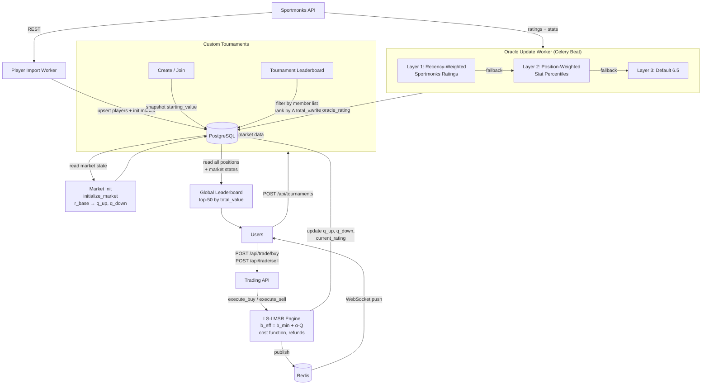

# LineUp Backend

A fantasy football prediction market where users trade on player performance ratings using a **Logarithmic Market Scoring Rule (LS-LMSR)** automated market maker. All players share a single global market state; custom tournaments are leaderboard filters on top of that shared data.

---

## Overview

### Unified Global Market

Every player has one `lmsr_market_state` row shared across all users and all tournaments. There are no per-tournament order books. This means:

- Trades in a tournament affect the global market for everyone
- Tournament leaderboards rank participants by profit/loss (Δ total_value) since they joined
- A completed tournament never blocks further trading

### LS-LMSR Pricing

LineUp uses **Liquidity-Sensitive LMSR** — the standard LMSR augmented with a dynamic liquidity parameter:

```
b_eff = b_min + α × (q_up + q_down)
```

`b_eff` grows with market activity, providing tighter spreads in high-volume markets and protecting thin markets from manipulation. Users trade a fixed **budget** (points) to receive a calculated number of shares, rather than specifying share quantities at trade time.

### 3-Layer Oracle

Oracle ratings seed market initial prices and are updated periodically by Celery workers:

| Layer | Trigger | Method |
|-------|---------|--------|
| **L1** | Sportmonks rating exists | Recency-weighted average of last 5 match ratings (weights: 0.35, 0.25, 0.20, 0.12, 0.08) |
| **L2** | Sportmonks ratings absent, match data exists | Position-weighted percentile composite of stats (goals, xG, tackles, saves, etc.) |
| **L3** | No match data | Default 6.5 |

### Sportmonks Integration

Player data (roster, ratings, stats) is pulled from the [Sportmonks v3 Football API](https://docs.sportmonks.com/football). The initial import covers La Liga (league 564) and Premier League (league 8).

---

## Setup

### Prerequisites

- Docker & Docker Compose
- Python 3.12+ (for running scripts outside Docker)
- A Sportmonks API token

### 1. Configure environment

```bash
cp .env.example .env
# Edit .env and set:
#   SPORTMONKS_API_TOKEN=<your token>
#   JWT_SECRET=<random secret>
#   POSTGRES_USER / POSTGRES_PASSWORD / POSTGRES_DB (optional, defaults provided)
```

### 2. Start services

```bash
docker compose up --build -d
```

This starts:
- `db` — PostgreSQL 15
- `redis` — Redis 7
- `api` — FastAPI on port 8000
- `celery_worker` — background task processor (4 workers)
- `celery_beat` — periodic task scheduler

The API waits for healthy DB and Redis before starting.

### 3. Run database migrations

```bash
docker compose exec api alembic upgrade head
```

### 4. Import players

```bash
docker compose exec api python scripts/run_initial_import.py
```

This fetches all active players for La Liga and Premier League from Sportmonks, upserts them into the `players` table, and initialises their `lmsr_market_state` rows using the oracle rating as the starting price.

The system is now ready. Visit `http://localhost:8000/docs` for the interactive API explorer.

---

## Running Tests

```bash
# All tests
docker compose exec api pytest

# Specific module
docker compose exec api pytest tests/test_lmsr.py -v

# With coverage
docker compose exec api pytest --cov=app --cov-report=term-missing
```

Key test files:

| File | Coverage |
|------|----------|
| `test_lmsr.py` | LS-LMSR math (cost, shares, refund, rating, init) |
| `test_oracle.py` | 3-layer oracle, percentile normalisation |
| `test_trading.py` | Buy/sell execution, budget checks, dust buffer |
| `test_market.py` | Market API endpoints |
| `test_leaderboard.py` | Global leaderboard ranking |
| `test_tournaments.py` | Tournament lifecycle, leaderboard filter |
| `test_integration_e2e.py` | Full trade → rating update → leaderboard flow |
| `test_calibration.py` | `b_min` auto-calibration |
| `test_oracle_update.py` | Celery oracle update worker |

---

## API Endpoints

### Auth

| Method | Path | Description |
|--------|------|-------------|
| `POST` | `/api/auth/register` | Register with username + password |
| `POST` | `/api/auth/login` | Login, receive JWT |

### Market

| Method | Path | Description |
|--------|------|-------------|
| `GET` | `/api/market/players` | List all active players with market state (`?league_id=`, `?search=`) |
| `GET` | `/api/market/players/{id}` | Single player market data (200 even if inactive — close-only mode) |
| `GET` | `/api/market/players/{id}/chart` | Historical rating timeline |

### Trading

| Method | Path | Auth | Description |
|--------|------|------|-------------|
| `POST` | `/api/trade/buy` | ✓ | Budget-based buy (`player_id`, `direction: UP\|DOWN`, `budget`) |
| `POST` | `/api/trade/sell` | ✓ | Share-quantity sell (`player_id`, `direction`, `shares`) |
| `POST` | `/api/trade/preview` | ✓ | Preview buy — no DB writes |

### Portfolio

| Method | Path | Auth | Description |
|--------|------|------|-------------|
| `GET` | `/api/portfolio/me` | ✓ | Current user's positions with unrealised PnL (LMSR sell-refund basis) |

### Leaderboard

| Method | Path | Description |
|--------|------|-------------|
| `GET` | `/api/leaderboard` | Global top-50 users by live total_value |

### Tournaments

| Method | Path | Auth | Description |
|--------|------|------|-------------|
| `POST` | `/api/tournaments` | ✓ | Create tournament (`name`, `start_time`, `end_time`) |
| `GET` | `/api/tournaments/mine` | ✓ | Tournaments the current user has joined |
| `POST` | `/api/tournaments/{id}/join` | ✓ | Join tournament; locks `starting_value` snapshot |
| `GET` | `/api/tournaments/{id}/leaderboard` | ✓ | Ranked by profit_loss; frozen snapshot when completed |

### Misc

| Method | Path | Description |
|--------|------|-------------|
| `GET` | `/health` | Health check |
| `WS` | `/ws/market` | WebSocket — real-time rating updates via Redis pub/sub |

---

## Architecture



---

## Parameter Tuning Guide

All parameters live in the `liquidity_config` table (single row) or per-player `lmsr_market_state`.

### `alpha` — Liquidity Sensitivity

```
b_eff = b_min + alpha * (q_up + q_down)
```

| Value | Effect |
|-------|--------|
| `0.0` | Fixed-`b` LMSR — slippage constant regardless of volume |
| `0.05` (default) | Moderate growth — spreads widen ~5% per share unit |
| `0.10+` | Aggressive — large trades incur significant slippage |

Increase `alpha` to protect the market from large single trades. Decrease it to improve liquidity for low-volume players.

### `b_min` — Baseline Liquidity

Minimum liquidity parameter. Controls the cost to move the market from 50/50 when no shares exist.

```
b_min = base_liquidity / n_reference
```

| Parameter | Default | Meaning |
|-----------|---------|---------|
| `base_liquidity` | 100.0 | Total points budgeted to seed all markets |
| `n_reference` | 50 | Reference number of active players |

**Effect:** Larger `b_min` → cheaper to buy shares, wider price range supported, more resistant to small trades. Smaller `b_min` → more volatile, fast-moving markets.

The `calibration` Celery task auto-updates `b_min` based on observed trading volume. Manual override: update `liquidity_config.base_liquidity` directly in the DB.

### `base_liquidity` — Market Seed Budget

Total virtual points used to initialise all markets. Increasing this spreads more liquidity across all players, dampening initial volatility. Applies at market init time; changing it after import only affects newly created markets.

### Oracle Weights (Layer 1)

Recency weights are hardcoded in `app/core/oracle.py`:

```python
_LAYER1_WEIGHTS = [0.35, 0.25, 0.20, 0.12, 0.08]  # most-recent → oldest
```

Edit to preference and redeploy. Increase the first weight to make ratings more reactive to the latest match; flatten the array for a pure rolling average.

### Oracle Position Weights (Layer 2)

Per-position stat weights are in `_POSITION_WEIGHTS` in `app/core/oracle.py`. Each entry is `(stat_key, weight, inverse)`. Weights within a position group are renormalised if a stat is missing, so they do not need to sum to exactly 1.0.

---

## Production Deployment

### First-time deploy

```bash
# 1. Copy and fill in production secrets
cp .env.prod.example .env.prod
# Set POSTGRES_PASSWORD, REDIS_PASSWORD, JWT_SECRET (openssl rand -hex 32)
# Set DOMAIN, TLS_EMAIL, SPORTMONKS_API_TOKEN

# 2. Make scripts executable
chmod +x deploy.sh scripts/healthcheck_cron.sh

# 3. Deploy (builds image, migrates DB, imports players, starts Caddy)
./deploy.sh --first
```

### Subsequent deploys

```bash
./deploy.sh
```

`deploy.sh` steps: `git pull` → build image tagged with git SHA → start DB/Redis → `alembic upgrade head` → restart services → health check → prune old images.

The initial import is guarded by a `.initial_import_done` sentinel file and skipped automatically after the first run. Pass `--first` to force re-import.

### Health check cron

```bash
# Install — runs every 5 minutes, appends to log
echo "*/5 * * * * /opt/lineup-backend/scripts/healthcheck_cron.sh >> /var/log/lineup-health.log 2>&1" \
  | crontab -

# Configure alerts (add to .env.prod or export before cron runs)
ALERT_WEBHOOK=https://hooks.slack.com/services/...   # Slack/Discord
ALERT_EMAIL=ops@yourdomain.com                        # fallback email
```

Checks performed every 5 minutes:

| Check | Threshold |
|-------|-----------|
| Docker healthcheck status for `db`, `redis`, `api` | Not `unhealthy` |
| `GET /health` HTTP response | 200 |
| `pg_isready` inside DB container | Accepting connections |
| Redis `PING` | PONG |
| Celery worker `inspect ping` | Responds within 5 s |
| Disk usage | < 85% |

Script is silent on success (cron-friendly). Fires webhook and/or email on any failure.

### Production files

| File | Purpose |
|------|---------|
| `docker-compose.prod.yml` | Production compose: Caddy, no exposed DB/Redis ports, log rotation, `restart: always` |
| `Caddyfile` | Reverse proxy config: auto-TLS, HSTS, WebSocket upgrade, security headers |
| `.env.prod.example` | Production env template (copy → `.env.prod`) |
| `deploy.sh` | Deployment script with sentinel-guarded initial import |
| `scripts/healthcheck_cron.sh` | Cron health monitor with webhook/email alerts |

---

## Project Structure

```
lineup-backend/
├── app/
│   ├── api/          # FastAPI routers (auth, market, trade, portfolio, leaderboard, tournament, websocket)
│   ├── core/         # Pure business logic (lmsr.py, oracle.py, trading.py, portfolio.py, auth.py, calibration.py)
│   ├── models/       # SQLAlchemy ORM models
│   ├── schemas/      # Pydantic request/response schemas
│   ├── services/     # External clients (sportmonks.py, redis_pubsub.py)
│   ├── workers/      # Celery tasks (player_import, fixture_sync, oracle_update, tournaments, calibration)
│   ├── config.py     # Pydantic Settings (reads .env)
│   ├── dependencies.py  # FastAPI dependency injection (get_db, get_current_user)
│   └── main.py       # App factory
├── alembic/          # Database migrations
├── scripts/
│   └── run_initial_import.py  # One-shot player import
├── tests/
├── docker-compose.yml
└── README.md
```
